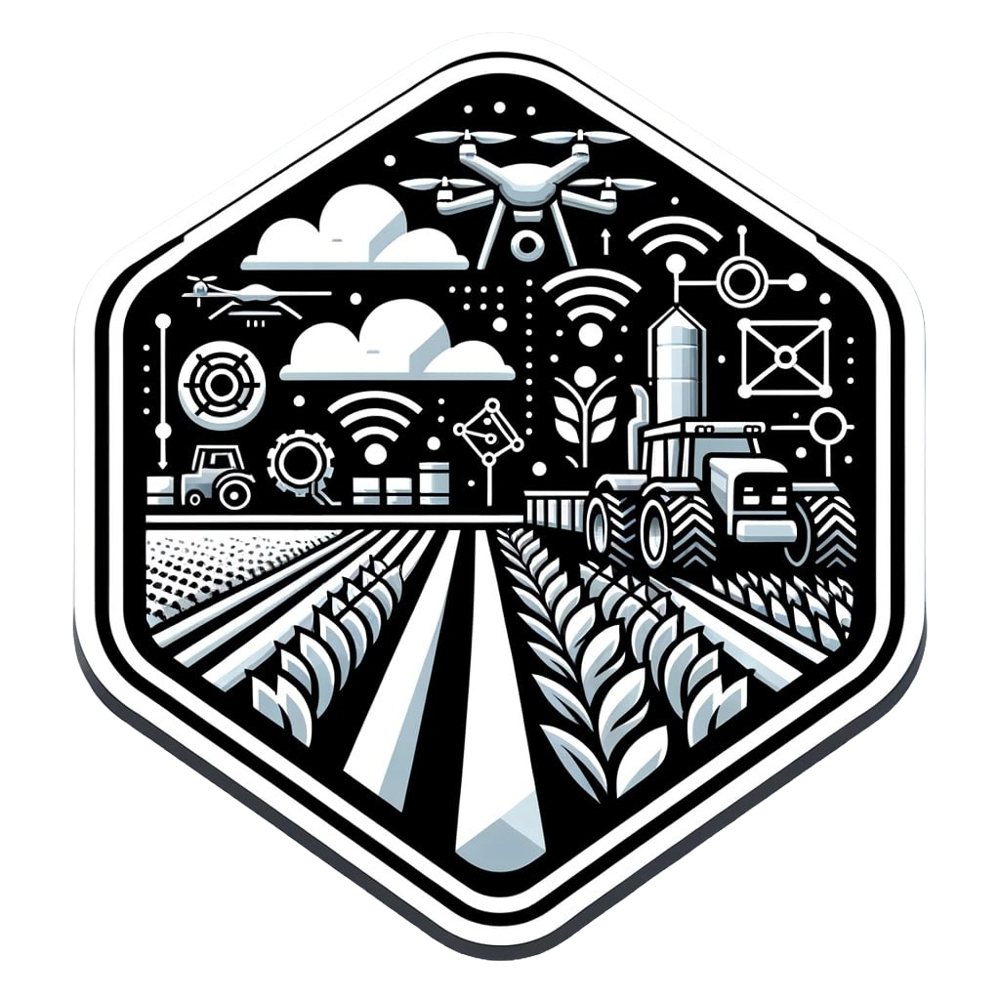

# <strong> QEM (Quality Estimation Module) </strong>

<p>


</p>

ROS service and client for the Quality Estimation Module, developed in the context of Canopies T4.3.

### [Detection Paper](https://www.sciencedirect.com/science/article/pii/S0168169923000121) | [Tracking Paper](https://arxiv.org/abs/2309.13393) | [Weights](https://drive.google.com/drive/u/0/folders/1mVx0H72kgdhsQiCfR_dsBlBvEjItnG5_) | [QEM Paper coming soon]

### <strong> Description of the package </strong>
The package contains different modules, that combined can provide an estimate of the quality of the grapes captured using a device like a RealSense Camera. The modules are:

* <strong> Detector: </strong> Yolov5 based detector for the grape bunches
* <strong> Qem service: </strong> Service that provides the quality for each grape bunch found by the detector. The quality is provided as a combination of the output of different sub-modules:
    * <strong> Anomaly: </strong> identification of visual defects like mold and rot
    * <strong> Brix: </strong> estimation of the sugar content of the grape
    * <strong> Color: </strong> estimation of the quality based on the external color of the grape
    * <strong> Size & Shape: </strong> classification of the size and shape of the grape
* <strong> Visualizer: </strong> RQT based visualizer which also provides the possibility to modify in real time the parameters for the various modules (detection confidence threshold, selection of modules to turn on or off, ...)

### <strong> Parameters </strong>
The package is equipped with a set of parameters that can be found in the folder:
```
    ./cfg/configuration_params.cfg
```
Here is possible to modify the parameters, but is necessary to compile again once modified, or is possible to modify those in realtime using the RQT gui of the visualizer. The parameters available are:
* <strong> image_topic (str): </strong> topic of the rgb image message on which to perform the inference
* <strong> depth_topic (str): </strong> topic of the depth image message on which to perform the inference
* <strong> bboxes_topic (str): </strong> topic of the bounding boxes found by the detector
* <strong> output_topic (str): </strong> topic on which the output of the QEM module is published
* <strong> valid_topic (str): </strong> topic with the list of the grape IDs approved by the quality module

* <strong> anomaly (bool): </strong> choose to activate or not the anomaly estimation module
* <strong> brix (bool): </strong> choose to activate or not the brix estimation module
* <strong> color (bool): </strong> choose to activate or not the color estimation module
* <strong> size (bool): </strong> choose to activate or not the size estimation module

* <strong> compressed (bool): </strong> activate if the image messages acquired by the device are in compressed format
* <strong> gpu (bool): </strong> load learning related modules in the GPU or CPU
* <strong> conf_thresh (double): </strong> confidence threshold of the detector

### <strong> Setup instructions </strong>
* Clone the Yolov5 repository in the package folder:
```
    git clone https://github.com/ultralytics/yolov5
```

* Install the requirements with the python dipendencies:
```
    pip install -r requirements.txt
```

* Copy the weights from the upper link and paste them inside the weights folder (detector.pt)

### <strong> Run the package: </strong>
Ros service with detector
```
    roslaunch qem_service qem_server.launch
```
Ros client
```
    rosrun qem_service qem_client.launch
```
